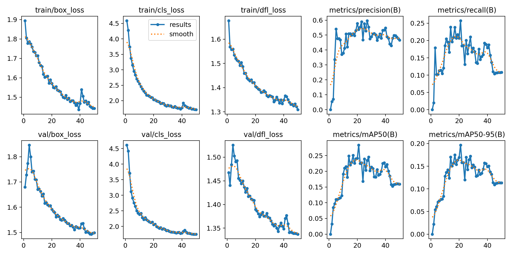
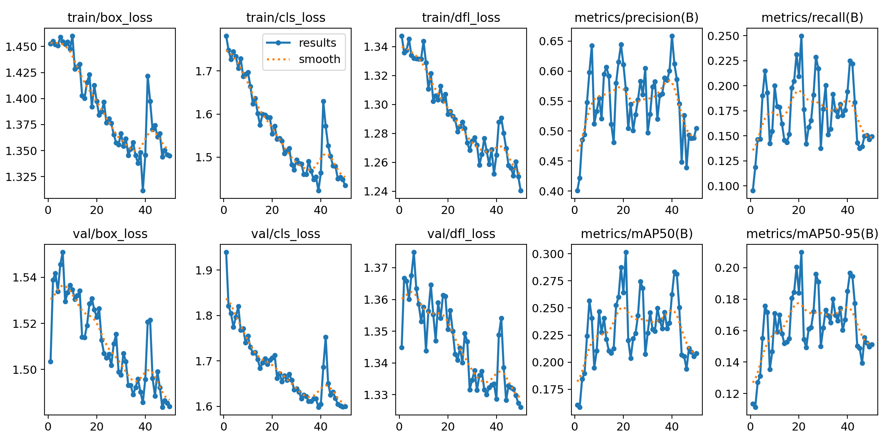
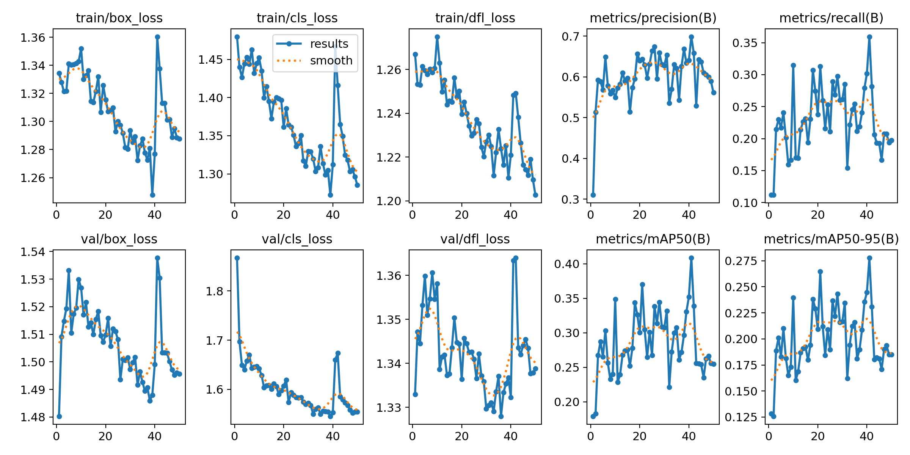

# Object tracking - for use by a drone

## Model
The [yolov8n](https://github.com/ultralytics/ultralytics) model was used to detect objects on the screen

## Dataset used for training - [link](https://www.kaggle.com/datasets/bulentsiyah/semantic-drone-dataset?resource=download)

### Training preparations
* Because of memory leaks images size was reduced for 40% with file ```quality_image_reducer.py```
* Then the masks were created for detection algorithm with file ```convert_rgb_masks.py```

### Training
Training took place in 3 iterations, after each one the results of the training were checked.

At each iteration the command was called:
```commandline
yolo train model=last.pt data=yolo-config.yaml epochs=50 imgsz=1280 device=cpu
```
>last.pt is trained model from last run iteration - the first time yolov8n.pt was used.

*cpu was used for training due to excessive test data volume*

## Results from particular training
### First run

### Second run

### Third run


