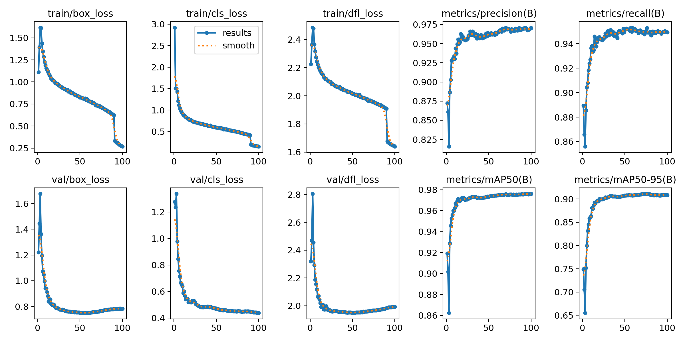

# Object tracking - for use by a drone

## Model
The [yolov8n](https://github.com/ultralytics/ultralytics) model was used to detect objects on the screen

## Dataset used for training - [link](https://github.com/VikramShenoy97/Human-Segmentation-Dataset/tree/master/Training_Images), [second link](https://www.kaggle.com/datasets/tapakah68/supervisely-filtered-segmentation-person-dataset)

Command called to train model:
```commandline
yolo train model=yolov8n.pt data=yolo-config.yaml epochs=400 imgsz=640 device=cuda
```

## Results from training


